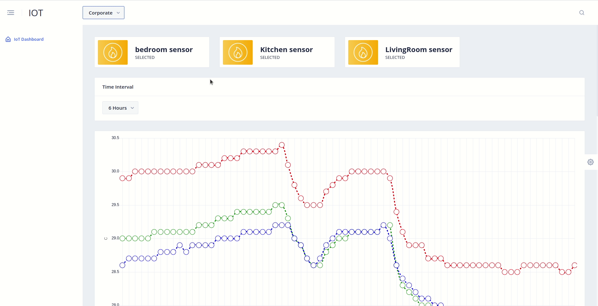
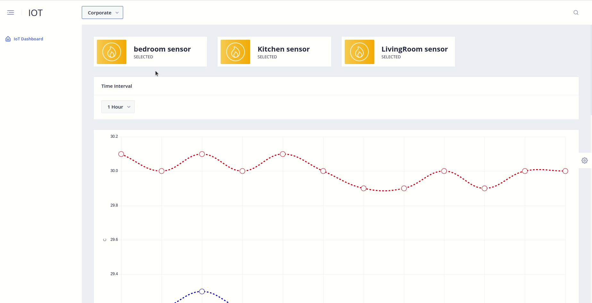
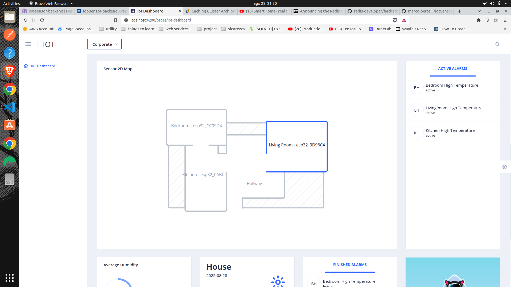
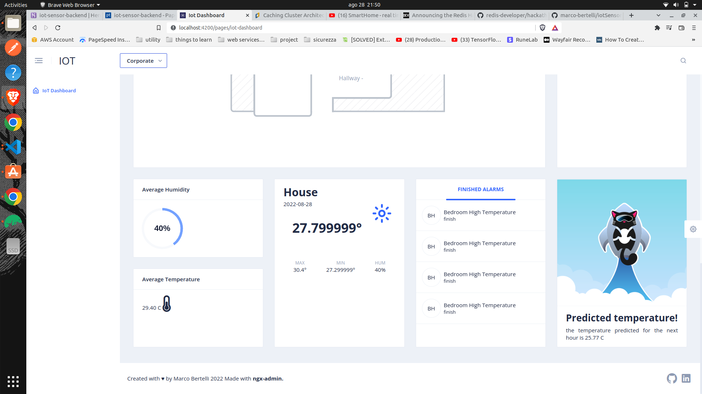
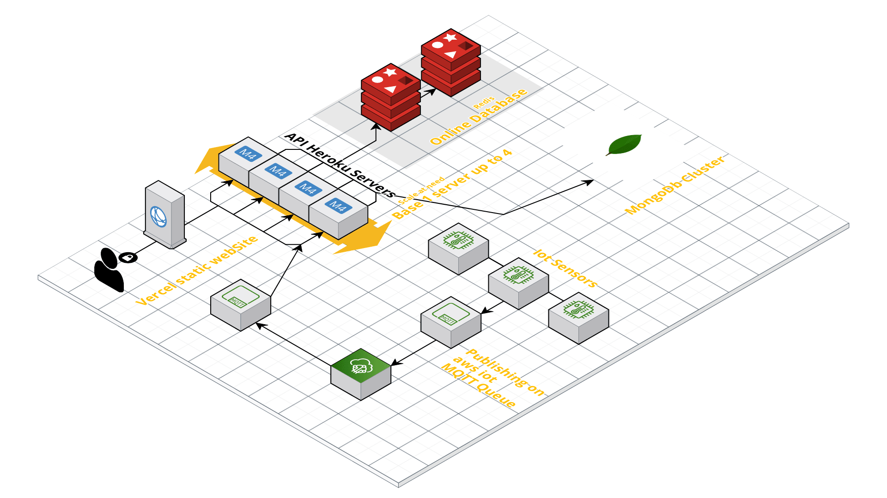

# SmartHome

this is a project that get real time temperature and humidity data from esp32 with DHT22 AM2302 temperature sensor. after this the data
is stored in both redis and MongoDb and processed from the frontend (see the other repo for more frontend info)

[](./assets/baseGraph.gif)

[](./assets/customColor.gif)

[](./assets/map.png)

[](./assets/footer.png)

# Overview video

Here's a short video that explains the project and how it uses Redis:

[](https://www.youtube.com/watch?v=0IFBh0KPuxA)

## How it works
before start is important to understand the app architecture:

[](./assets/architecture.png)

as we can see there are many different parts:
* Backend: (this repo) write using node js and TS, handle the redis integration using redis OM, MongoDb integration, Aws Iot real time MQTT connection
and Tensorflow js model utilization. Use redis for reading the real time sensor messagges over the MQTT channel "machines" and try to find a sensor associated with it,
if found insert a datalog of the received data in both MongoDb and redis for rapid real time data into the frontend graph.
the alarm logic is associated to the datalogs, if when a datalog is created trigger an alarm rule an active alarm is created and will be closed only when an alarm below the trashold arrive, all the alarms are stored and not deleted.
Tensorflow is used to read a very simple regression model and use it for the next hour predictions.

* Frontend: retrive the data from the backend API to make a graph based on a custom range time, in the graph you can choose the sensor who data you want to see,
there is also the average temperature and humidity cards in the bottom of the dashboard that show you the Average in the **selected range**. 
the alrams are real time and retrived with only 1 minute cache to don't lose the new alarms, as explained before the alrams are created only when a value trigger an alarm trashold.
there is also a home map to see the sensors disposition and have an idea of the space, the "SUN" card show you the **actual** values and not the average.
the last card show you the prediction fo the next hour.
All the components support the **multi theme** feature to personalize the user experience.

### How the data is stored:

* basic models.
    * alarms:
        * sensorId: id of the sonsor
        * ruleId: if generated by a rule the ruleId
        * rule: for rules type alram the rule logic
        * name: name to show of the alram
        * type:  enum: ['active', 'finish', 'rule'],
        * triggerValue: start alarm value
        * detriggerValue: end alarm value
        * startDate
        * finishDate
        
    * datalogs:
        * sensorId: id of the sonsor
        * value: temp value
        * measureUnit: at this time only C
        * timestamp: time of the recorded value
        * humidity: stored only in **MongoDb** to keep redis more clean and fast for graph data
        
    * sensors:
        * code
        * type: for now only temperature type
        * name
        * color: the color to show into the graph

the most cool part of the data is the alram logic:
```
{
    "_id" : ObjectId("6300e639830e983ff546f7af"),
    "sensorId" : ObjectId("62fce2bc830e983ff546f775"),
    "rule" : {
        ">" : [
            {
                "var" : "temp"
            },
            25.0
        ]
    },
    "name" : "Bedroom High Temperature",
    "type" : "rule"
}
```

as we can see the logic is saved direct into the alarm! this is possible for the JSON Logic NPM library. (this alarm start if sensor XXX go up to 25 degree)

### How the data is accessed:

Refer to [this example](https://github.com/redis-developer/basic-analytics-dashboard-redis-bitmaps-nodejs#how-the-data-is-accessed) for a more detailed example of what you need for this section.

### Performance Benchmarks

[If you migrated an existing app to use Redis, please put performance benchmarks here to show the performance improvements.]

## How to run it locally?

[Make sure you test this with a fresh clone of your repo, these instructions will be used to judge your app.]

### Prerequisites

[Fill out with any prerequisites (e.g. Node, Docker, etc.). Specify minimum versions]

### Local installation

[Insert instructions for local installation]

## Deployment

To make deploys work, you need to create free account on [Redis Cloud](https://redis.info/try-free-dev-to)

### Google Cloud Run

[Insert Run on Google button](https://cloud.google.com/blog/products/serverless/introducing-cloud-run-button-click-to-deploy-your-git-repos-to-google-cloud)

### Heroku

[Insert Deploy on Heroku button](https://devcenter.heroku.com/articles/heroku-button)

### Netlify

[Insert Deploy on Netlify button](https://www.netlify.com/blog/2016/11/29/introducing-the-deploy-to-netlify-button/)

### Vercel

[Insert Deploy on Vercel button](https://vercel.com/docs/deploy-button)

## More Information about Redis Stack

Here some resources to help you quickly get started using Redis Stack. If you still have questions, feel free to ask them in the [Redis Discord](https://discord.gg/redis) or on [Twitter](https://twitter.com/redisinc).

### Getting Started

1. Sign up for a [free Redis Cloud account using this link](https://redis.info/try-free-dev-to) and use the [Redis Stack database in the cloud](https://developer.redis.com/create/rediscloud).
1. Based on the language/framework you want to use, you will find the following client libraries:
    - [Redis OM .NET (C#)](https://github.com/redis/redis-om-dotnet)
        - Watch this [getting started video](https://www.youtube.com/watch?v=ZHPXKrJCYNA)
        - Follow this [getting started guide](https://redis.io/docs/stack/get-started/tutorials/stack-dotnet/)
    - [Redis OM Node (JS)](https://github.com/redis/redis-om-node)
        - Watch this [getting started video](https://www.youtube.com/watch?v=KUfufrwpBkM)
        - Follow this [getting started guide](https://redis.io/docs/stack/get-started/tutorials/stack-node/)
    - [Redis OM Python](https://github.com/redis/redis-om-python)
        - Watch this [getting started video](https://www.youtube.com/watch?v=PPT1FElAS84)
        - Follow this [getting started guide](https://redis.io/docs/stack/get-started/tutorials/stack-python/)
    - [Redis OM Spring (Java)](https://github.com/redis/redis-om-spring)
        - Watch this [getting started video](https://www.youtube.com/watch?v=YhQX8pHy3hk)
        - Follow this [getting started guide](https://redis.io/docs/stack/get-started/tutorials/stack-spring/)

The above videos and guides should be enough to get you started in your desired language/framework. From there you can expand and develop your app. Use the resources below to help guide you further:

1. [Developer Hub](https://redis.info/devhub) - The main developer page for Redis, where you can find information on building using Redis with sample projects, guides, and tutorials.
1. [Redis Stack getting started page](https://redis.io/docs/stack/) - Lists all the Redis Stack features. From there you can find relevant docs and tutorials for all the capabilities of Redis Stack.
1. [Redis Rediscover](https://redis.com/rediscover/) - Provides use-cases for Redis as well as real-world examples and educational material
1. [RedisInsight - Desktop GUI tool](https://redis.info/redisinsight) - Use this to connect to Redis to visually see the data. It also has a CLI inside it that lets you send Redis CLI commands. It also has a profiler so you can see commands that are run on your Redis instance in real-time
1. Youtube Videos
    - [Official Redis Youtube channel](https://redis.info/youtube)
    - [Redis Stack videos](https://www.youtube.com/watch?v=LaiQFZ5bXaM&list=PL83Wfqi-zYZFIQyTMUU6X7rPW2kVV-Ppb) - Help you get started modeling data, using Redis OM, and exploring Redis Stack
    - [Redis Stack Real-Time Stock App](https://www.youtube.com/watch?v=mUNFvyrsl8Q) from Ahmad Bazzi
    - [Build a Fullstack Next.js app](https://www.youtube.com/watch?v=DOIWQddRD5M) with Fireship.io
    - [Microservices with Redis Course](https://www.youtube.com/watch?v=Cy9fAvsXGZA) by Scalable Scripts on freeCodeCamp

